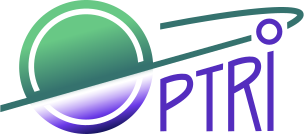

# OptriSpace Web

## Getting Started

Visit [https://optrispace.com/](https://optrispace.com/) to learn more about us.

## Community

Our community can be found on [Twitter](https://twitter.com/optrispace),
where you can ask questions, voice ideas, and get support.

## Code of Conduct

Please see our [CODE_OF_CONDUCT.md](./CODE_OF_CONDUCT.md)

## Contributing

Please see our [CONTRIBUTING.md](./CONTRIBUTING.md)

## Authors

- Maxim Kovrov ([@almaz-uno](https://github.com/almaz-uno))
- Alexander Kadyrov ([@gruz0](https://github.com/gruz0))
